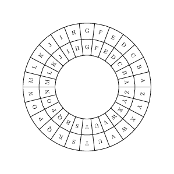

## Pytest

* TDD (Test-driven development)
* Running pytest
* Parameterized tests
* Coverage report
* Testing exceptions
  
---

*“I'm not a great programmer; I'm just a good programmer with great habits.”* 
― Kent Beck

---


## `pytest` is the de facto testing framework in python

* python comes with a built in testing framework called unittest (but almost everyone uses pytest)
* Install with `python3 -m pip install pytest`
* Run with `python3 -m pytest`
* When running `pytest`, it will look for all files containing `test` in the name and run all functions starting with `test`
    ```python
    # test_my_module.py

    def test_solver():
        ...
    ```

---

## Example case
- Implementation of Caesar cipher
- You select a shift (key), and you rotate the alphabet that number of places
- This will give you a new alphabet
- Swap out all letter with letters in the new alphabet
- https://cryptii.com/pipes/caesar-cipher



---

## Example usage

```python
>> shift = 1
>> msg = "hello"
>> encrypted_message = encrypt(msg, shift=shift)
>> print(encrypted_message)
ifmmp
```

---

- Create a module `caesar_cipher.py` and a test file `test_caesar_cipher.py`
- Implement a method of encryption and decryption

---


## Run `pytest`

To run `pytest`, do

```
python -m pytest test_caesar_cipher.py
```

or

```
python -m pytest
```

or
```
pytest
```
or
```
py.test
```

---

## More verbose

You can get more verbose output by using the `-v` flag

```
python -m pytest -v
```

---

## Run a specific test
To run a specific test use the `-k` flag

```
python -m pytest test_caesar_cipher.py -k test_encrypt
```
Note that this will run all tests that starts with `test_encrypt` (i.e also a test called `test_encrypt_hello`)

---

## Turn on printing

`pytest` turns off printing by default.

You can turn it on again by using the `-s` flag, i.e
```
python -m pytest test_caesar_cipher.py -s
```

---

## Parameterized tests

- We try to obey the DRY (Don't Repeat Yourself) principle. When writing tests it is easy to do a lot of copy-pasting

    ```python
    def test_encrypt_hello():
        assert caesar_cipher.encrypt("hello", shift=1) == "ifmmp"

    def test_encrypt_welcome():
        assert caesar_cipher.encrypt("welcome", shift=7) == "dlsjvtl"
    ```

* We can refactor this into a single test function
    ```python
    def test_encrypt(msg, shift, expected_output):
        assert caesar_cipher.encrypt(msg, shift=shift) == expected_output

    ```

---

## Parameterized tests

- We can execute multiple tests in a `for`-loop
  ```python
  for msg, shift, expected_output in [
        ("hello", 1, "ifmmp"),
        ("welcome", 7, "dlsjvtl"),
    ]:
        caesar_cipher.encrypt(msg, shift, expected_output)
  ```

---

## Parameterized tests in `pytest`

- The way to do this in `pytest` is to decorate the function with the `@pytest.mark.parametrize` decorator
  ```python
  @pytest.mark.parametrize(
        "msg, shift, expected_output", [("hello", 1, "ifmmp"), ("welcome", 7, "dlsjvtl")]
    )
    def test_encrypt(msg, shift, expected_output):
        assert caesar_cipher.encrypt(msg, shift=shift) == expected_output
  ```

---


---

## Try some different input

Try to encrypt the following message `"Hello"`

* Convert all string to lower case.

---

## Try to encrypt a number (e.g 42)

* Raise a `TypeError` if you try to encrypt something different from a string

---

## Have we tested all of the code?

* To check that we haven't missed any cases we can run a tool called `coverage`
* In `pytest` we can use `pytest-cov` (`python -m pip install pytest-cov`)
* Now run `pytest` with the command `--cov`

```
python -m pytest test_caesar_cipher.py --cov
```

---

## You can also specify the file you want to check

```
python -m pytest test_caesar_cipher.py --cov=caesar_cipher
```

---

## We can ask to get the lines that are not covered by the tests

```
python -m pytest test_caesar_cipher.py --cov=caesar_cipher --cov-report term-missing
```

---

## You can also get a more visual representation using `--cov-report html`

This will create a a new folder called `htmlcov`
Open the file `htmlcov/index.html` to get more info

---

## What we didn't cover but

- `pytest.fixture` - If you want to reuse the same data in multiple functions
- `conftest.py` - File where you can put fixtures that will be available for all files
- Mocking - Exchange objects in your code with "dummy" objects
